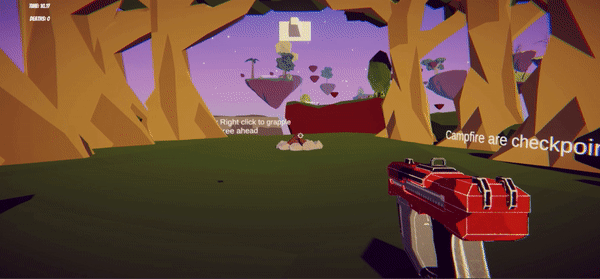
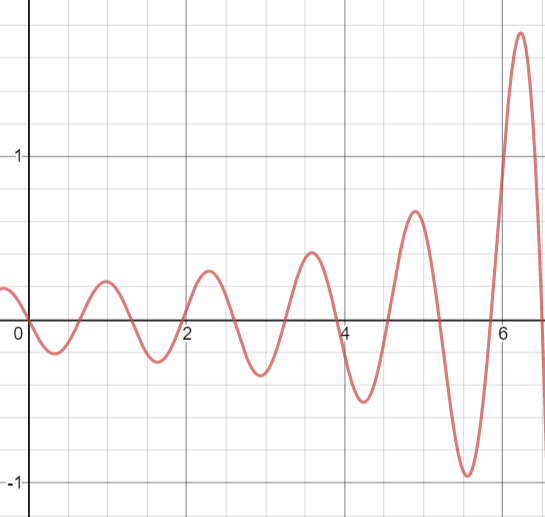

**The University of Melbourne**
# COMP30019 – Graphics and Interaction


# Project-2 README

## Table of contents
- [COMP30019 – Graphics and Interaction](#comp30019--graphics-and-interaction)
- [Project-2 README](#project-2-readme)
  - [Table of contents](#table-of-contents)
  - [Team Members](#team-members)
  - [Explanation of the game](#explanation-of-the-game)
  - [How to use it](#how-to-use-it)
    - [Basic controls](#basic-controls)
    - [User interface in game](#user-interface-in-game)
    - [User interface in main-menu](#user-interface-in-main-menu)
    - [User interface when paused](#user-interface-when-paused)
    - [User interface when player reached the end/flag](#user-interface-when-player-reached-the-endflag)
  - [Modelled objects and Entities](#modelled-objects-and-entities)
  - [Graphics Pipeline and Camera Motion](#graphics-pipeline-and-camera-motion)
  - [Graphics pipeline](#graphics-pipeline)
  - [Camera Motion](#camera-motion)
  - [Descriptions of how the shaders work](#descriptions-of-how-the-shaders-work)
    - [Flag Shader](#flag-shader)
    - [Toon Shader](#toon-shader)
      - [Lighting & Ambient Light](#lighting--ambient-light)
      - [Specular Reflection](#specular-reflection)
      - [Rim Lighting](#rim-lighting)
      - [Shadows](#shadows)
  - [Querying and observational methods used](#querying-and-observational-methods-used)
    - [Post-task interview](#post-task-interview)
    - [Questionnaire](#questionnaire)
  - [Documentation of changes](#documentation-of-changes)
  - [Code/APIs you have sourced/used from the internet that is not your own](#codeapis-you-have-sourcedused-from-the-internet-that-is-not-your-own)
  - [Contributions](#contributions)

## Team Members

| Name | Task | State |
| :---         |     :---:      |          ---: |
| Nikolas Leander Putra  | MainScene, Shader, Particles & Grappling Physics |  Done |
| Kelvin Hu    | MainScene, MenuScene & Graphics      |  Done |
| Girish Madnani    | MenuScene, Player Movement & Camera motion      |  Done
| Kevin Linarto  |   MainScene, Graphics, Shader & Particles    |  Done |

## Explanation of the game
Our game is a first person adventure game where the player needs to navigate through obstacles and move towards the very top of the lost islands. The player will control a character equipped with a grappling gun, allowing the player to either swing from island to islands, or grapple onto an object which pulls the player towards it.

The player will adventure into a map that is designed to have multiple pathways that the players are able to take, where player can always try and discover new pathways to take while enjoying the scenery. With different biomes each with different difficulty design, the player will need to decide to swing or grapple in a quick time manner to avoid falling into the abyss.

Through ingenuity, aiming, and quick reaction, the player will be able to progressively improve their aiming and skill and attempt to reach to the top in the shortest time possible and lowest deaths possible.

## How to use it

### Basic controls
W: Move Forward\
S: Move Backward\
A: Strafe Left\
D: Strafe Right\
Space: Jump\
Right Click: Grapple\
Left Click: Swing\
Esc: Pause Game

### User interface in game
Time: Tells the time since the run have been started\
Deaths: Tells how many times the player has fallen of the map\
Crosshair: Shows where the player will launch the grappling gun\
Arrow: Shows the player where is the location of the next checkpoint\

### User interface in main-menu
Play: Starts the game\
Controls Info: Informs user about the controls of the game\
Exit: Exits the game

### User interface when paused
Resume: Resumes the game\
Main-Menu: Returns player to the main-menu\
Exit: Exits the game

### User interface when player reached the end/flag
Celebratory "You Win"\
Stats: Shows the player how much time and deaths they did along the way\
Play Again: Restarts the game to the beginning and resets the time and death counter

## Modelled objects and Entities
The models and entities were mostly gained from the asset store.\
**Landscape assets**:
- https://assetstore.unity.com/packages/3d/environments/landscapes/low-poly-cliff-pack-67289
- https://assetstore.unity.com/packages/3d/environments/low-poly-s-pack-vol-2-46375
- https://assetstore.unity.com/packages/3d/environments/polygonal-foliage-asset-package-133037

**Crosshair image**: https://assetstore.unity.com/packages/2d/gui/icons/simple-modern-crosshairs-pack-1-79034\
**Skybox**: https://assetstore.unity.com/packages/vfx/shaders/free-skybox-extended-shader-107400\
**Free fly camera (for video/game-trailer only)**: https://assetstore.unity.com/packages/tools/camera/free-fly-camera-140739\
**Arrow waypointer**: https://assetstore.unity.com/packages/tools/particles-effects/arrow-waypointer-22642\
**Campfire**: https://assetstore.unity.com/packages/templates/packs/low-poly-game-kit-110455#content\
**Grappling gun**: https://assetstore.unity.com/packages/3d/props/guns/lowpoly-scifi-pistol-125412\
**Grappling hook (not used in the final iteration of the project)**: Hand-made :D

The player contains a rigidbody and a capsule collider to interact with its surroundings. All landscapes such as rocks, trees, islands, etc all have colliders to interact with the player. Some objects have its layer defined as "grappable" to inform the grappling gun raycast that it will trigger when an object is in the layer "grappable". Previous iteration of the tool used to grapple (grappling hook) used tag "hookable" instead (not used in the final iteration of the project). When the grappling gun is shot and hits, a spring joint is created to have the physics of swinging or grappling, and a line renderer is turned on to show the player that they are attached.

The player also contains a sphere collider at the bottom of it. It is used for the groundcheck which enable the player to jump a certain force and it triggers a particle system dust cloud when it in contact with all the "Grounded" layer islands.

<p align="center">
  
  <p align="center">Fig 1: dustcloud on land</p>
  <br/>
</p>

The campfire is actually the fireplace mesh from this asset: https://assetstore.unity.com/packages/templates/packs/low-poly-game-kit-110455#content. This object is used in the game as checkpoints, so when a player falls of the map, he/she will return back to the latest checkpoint. The idea for a campfire is inspired by Dark Souls bonfires. The campfire has a box collider that surrounds the campfire and is a trigger for the checkpoint script in the player. When a player reaches the campfire, it will light up and play a fire particle effect to visually tell the player that this is their current checkpoint, and when a new checkpoint is set, the fire and light will be disabled to indicate that it is an inactive checkpoint.

<p align="center">
  
  <p align="center">Fig 2: checkpoint feature & fire particle system</p>
  <br/>
</p>

<p align="center">
  
  <p align="center">Fig 3: respawn feature & mist particle system</p>
  <br/>
</p>

We also have a confetti particle effect that triggers when the player reached the end flag collider.

<p align="center">
  
  <p align="center">Fig 4: confetti particle system at end game</p>
  <br/>
</p>

## Graphics Pipeline and Camera Motion

## Graphics pipeline
For the graphics pipeline, we used vertex and pixel (fragment) shader to implement the toon style of our game, as well as, the movement of the ending flag. The vertex shader is to obtain positions, normals and uvs of the objects, as well as displace the position of vertices. The pixel (fragment) shader is used for manipulating the lighting of objects. We do not implement CPU/GPU split since the game already runs well.

## Camera Motion
The camera used is a simple fps camera. It uses the mouse X-axis and Y-axis movement. It is bounded between -90f and 90f along the Y-axis inorder to avoid overturning. The camera transforms the rotatation of the player which facilitates the player movement.

<p align="center">
  
  <p align="center">Fig 5: player movement using 'W', 'A', 'S' and 'D' keys</p>
  <br/>
</p>

<p align="center">
  
  <p align="center">Fig 6: camera motion using mouse</p>
  <br/>
</p>

## Descriptions of how the shaders work

### Flag Shader

The Flag shader was an altered implementation of the sine wave shader from the tutorial. Instead of a normal sine wave, it is a damped sine wave where the amplitude of the wave gets smaller or bigger as time increased.

<p align="center">
  
  <p align="center">Fig 7: damped sine wave</p>
  <br/>
</p>


**The parameters of the damped sine wave is the following:**
```ShaderLab
float amp = 3;
float b = -7;
float speed = 4;
float4 displacement = float4(0.0f, (amp/(b + v.vertex.x)) * sin(v.vertex.x + _Time.y * speed), 0.0f, 0.0f);
```
### Toon Shader

The toon shader was heavily inspired by this tutorial: https://roystan.net/articles/toon-shader.html. It uses the Blinn-Phong shading model to calculate the lighting and uses smoothstep to blend between the two bands, light and dark.

#### Lighting & Ambient Light

As mentioned above we used the Blinn-Phong shading model to calculate lighting. Lighting was achieved by calculating the dot product between the directional light and the normal. Then to achieve the toon look, we divide the lighting into two bands, light and dark and we use smoothstep to smoothly blend between the two bands. Finally we just add the ambient light color to the lighting calculation.

```ShaderLab
// Divide the lighting into two bands
float lightStrength = smoothstep(0, 0.01, NdotL);
```

#### Specular Reflection

The difference between specular reflection in the Phong shading model taught in the tutorials and Blinn-Phong is the way it is calculated. Blinn-Phong measures the angle between the normal and half vector instead of the angle between the reflection and view vector. The `pow` allows us to control the strength of the specular reflection. The _Shininess multiplied by itself is to allow smaller values in the material editor to have a larger effect.

```ShaderLab
float3 halfVector = normalize(_WorldSpaceLightPos0 + viewDir);

// Calculate the dot product between the half vector
// and the normal vector
float NdotH = dot(halfVector, normal);

// Calculate the specular intensity when the surface is lit
float specularStrength = pow(NdotH * lightStrength, _Shininess * _Shininess);

// Use smoothstep to smoothly blend the specular reflections to achieve
// the toon like specular reflection
float specularStrengthSmooth = smoothstep(0.005, 0.01, specularStrength);
```

#### Rim Lighting

An important aspect of the toon like shaders are the illuminatioof an object's edges to simulate backlighting or reflected light. This helps the object's silhouette stand out among the flat shaded surfaces. The rim of an object are the surfaces that are facing away from the camera, thus to calculate the rim, we wil take the dot product of the normal and view direction and then inverting it.

```ShaderLab
// Calculate the dot product of the normal and view direction vector
// and then inverting it to get the rim
float4 rimDot = 1 - dot(normal, viewDir);

// Make the rim lighting only appear on illuminated surfaces of the object
// and control how far the rim extends along the lit surface
float rimStrength = rimDot * pow(NdotL, _RimThreshold);

// Use smoothstep to smoothly blend the rim lighting to achieve the
// toon like rim lighting
rimStrength = smoothstep(_RimAmount - 0.01, _RimAmount + 0.01, rimStrength);
float4 rim = rimStrength * _RimColor;
```

#### Shadows

Most of the shader code and explanation for the shadows are the same as the tutorial as explanations are pretty standard and the shadows are mostly implemented using Unity's built in shaders and **AutoLight.cginc**. After our toon shader, we add a pass that is used by Unity during the shadow casting step of the rendering process. To receive shadows, we will need to know in the fragment shader whether a surface is in the shadow or not. To sample the shadow map cast by a light, we'll need to transfer texture coordinates from the vertex shader to the fragment shader.

**Defined in the v2f struct (vertex to fragment struct):**
```ShaderLab
// Defined in AutoLight.cginc, creates a 4D value
// with varying precision and assigns it to
// TEXCOORD2 semantic
SHADOW_COORDS(2)
```

**Vertex shader:**
```ShaderLab
// Defined in AutoLight.cginc, transforms the input
// vertex's space to the shadow map's space
TRANSFER_SHADOW(o);
```

**Fragment shader:**
```ShaderLab
// Defined in AutoLight.cginc, SHADOW_ATTENUATION returns a value
// between 0 and 1, where 0 indicates no shadow and 1 is fully shadowed
float shadow = SHADOW_ATTENUATION(i);

float lightStrength = smoothstep(0, 0.01, NdotL * shadow);
```

## Querying and observational methods used

For each user during user evaluation, the team either implemented a post-task interview, or provided a questionnaire for the user to fill out. The team invited 17 users in total, 9 of which was done through post-task interview and 8 were done with Questionnaires.

The demographic of the participants were: 8 people who were somewhat experienced with games and 9 people who rarely plays games, 9 participants were female and 8 participants were male.

### Post-task interview

- We interviewed 9 participants in total, with varying skills and experience in terms of gaming.
- The participants were asked to complete and explore the game by themselves to avoid excessive interruption of their tasks. In case a problem within the game arose, the participants were asked to try and resolve it by themselves, and if they fail to do so, the analyzer will intervene.
- After the participants have completed the game, several questions were asked and documented through user notebooks, specifically in a private google docs form.

Questions asked and feedbacks are summarized below:
>**How is the movement of the player in both air and ground:**\
The movement was very fluid and smooth, but there were several feedbacks requesting an increase in jump height and gravity.

>**Do you prefer the gun or the hook? Why?:**\
Most participants liked the gun. A few participants liked the hook. Summary of the reasons why are listed below.\
Features of grappling gun:
>- latching on objects feels very consistent
>- sadly, there is no cool animation of shooting the gun
>- gun rotates to the direction of where it grapples

<p align="center">
  
  <p align="center">Fig 8: gun grappling using right click on mouse</p>
  <br/>
</p>

<p align="center">
  
  <p align="center">Fig 9: gun swinging using left click on mouse</p>
  <br/>
</p>

>Features of grappling hook:
>- there is animation of the grappling hook getting cast
>- sometimes hooks are inconsistent

<p align="center">
  
  <p align="center">Fig 10: hook grappling using right click on mouse</p>
  <br/>
</p>

<p align="center">
  
  <p align="center">Fig 11: hook swinging using left click on mouse</p>
  <br/>
</p>

The reason why the grappling hook was sometimes inconsistent was because that colliders and unity update method were used to detect collisions. Sometimes, if the object was small, the hook will go through the object without registering the collision. On the other hand, raycasts were used for the grappling gun to get very consistent grapples. However, this sacrifices the aspects of being able to launch the grapple.

>**What UI aspects do you recommend to add to the game?**\
Feedback includes adding a time limit, or a timer. Adding a way to point the player in the correct direction, a mini-map potentially

>**Throughout the game, was it easy to identify grappable objects?**\
Less experienced players were having difficulties to identify which objects are grappable, whereas participants with background to gaming were having lesser problems

>**Does the game make it clear the direction you have to progress in:**\
Lesser experienced players were having problems knowing which way to go, participants were requesting an indicator

>**Would you prefer an interactive tutorial or just text that explains the controls:**\
Yes, a tutorial was generally requested

>**How is the pace of the game, specifically progression:**\
it was fast paced, participants with backgrounds to gaming found the game to be fun and rewarding while lesser experienced players were having trouble in the first stage

>**Was the game challenging enough?**\
Yes

### Questionnaire

- We interviewed 8 participants with varying skills and experience in terms of gaming using Questionnaires.
- The participants were asked to complete and explore the game by themselves to avoid excessive interruption to their tasks. In case a problem within the game arose, the participants are asked to try and resolve it by themselves, and if they fail to do so, the analyzer will intervene.
- After the participants finish their games,  a questionnaire was given for them to fill out
- The questionnaire contains scalar questions where participants were asked to answer a question on a scale of 1 to 5, 5 being strongly agree and 1 being strongly disagree. The topic of gameplay elements and user experience is the focus of the Questionnaire, containing 10 questions in total

- The questions and feedback(using median to represent) were summarized as below:

> I found that the controls were easy to use: 5
>
> I found the game challenging as it progressed: 5
>
>The game felt smooth and fluid: 4
>
>I found myself always knowing what to do: 3
>
>I found the game visually aesthetic: 5
>
>I found the game to perform smoothly: 4
>
>I found my skills gradually improve throughout the game: 5
>
>I found the game to be engaging: 5
>
>I found the game to be enjoyable and fun: 5

## Documentation of changes
>**Problem #1**: From the Questionnaire as well as the post-task interviews, we found that players were having trouble understanding the controls at the start of the game.
>
>**Changes #1**: We’ve added tutorial texts in the starting region, providing information to players to gain an understanding of the moves they can pull off (grappling and swinging). As well as telling players what objects are grappable and what objects are not.

>**Problem #2**: We found that players often have trouble to identify which objects are grappable.
>
>**Changes #2**: On top of the tutorial message, the cursor now turns green when hovering over objects that are in range to grapple

>**Problem #3**: During the interviews, we found out that lesser experienced participants (those who do not play games often) are having trouble of knowing where to go.
>
>**Changes #3**: We added a waypoint arrow on the top of the screen which points towards the next checkpoint, providing players the information of where to go.

>**Problem/Suggestion #4**: There were users who wish to have a timer and a death counter so they can try and beat their own record
>
>**Changes #4**: We added a timer as well as a death counter.

## Code/APIs you have sourced/used from the internet that is not your own
- Useful for understanding concept of grappling hook logic flow: https://www.youtube.com/watch?v=MR1XK-q265E
- Useful for understanding grappling gun, how to rotate gun at location, and how spring hooks work: https://www.youtube.com/watch?v=Xgh4v1w5DxU
- Arrow waypointer feature: https://assetstore.unity.com/packages/tools/particles-effects/arrow-waypointer-22642
- Tutorial for toon shader that we heavily use: https://roystan.net/articles/toon-shader.html
- Understanding movement by using add force velocity change from: https://answers.unity.com/questions/1515686/calculate-player-velocity-change-while-taking-into.html

## Contributions
**Girish Madnani**: Main Scene (Pause Menu & Main Menu), Movement (including player movement & camera motion)

**Kelvin Hu**: Main Menu Scene and scripts, Graphics (including map design & creation)

**Kevin Linarto**: MainScene, Graphics (Post process), Shader (Toon shader), Particles (Fog & Campfire)

**Nikolas Leander Putra**: Grappling physics implementation, Shader (Flag shader), Particles (Fog & Confetti), Movement (player movement)

## License
[MIT](https://choosealicense.com/licenses/mit/)
